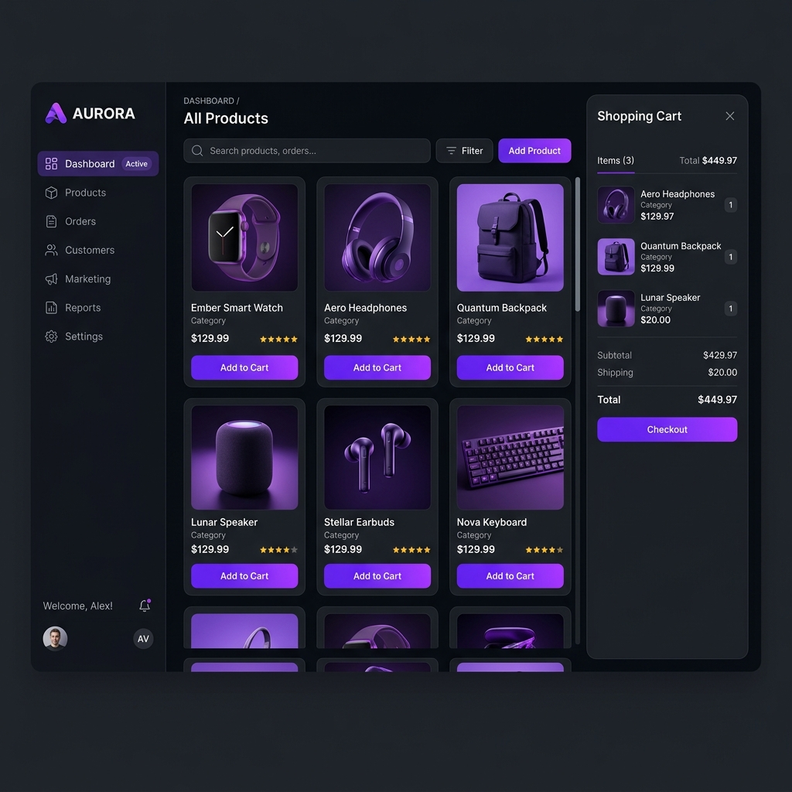

# 🛒 ShopEase - Forest Green E-Commerce Storefront

A modern e-commerce retail web application rebuilt with a distinct, human-designed **Forest Green & Warm Cream** light theme to showcase premium frontend design.

## ✨ Humanized & Localized Features
- 🇰🇪 **Local Pricing** — All product prices are listed in Kenyan Shillings (KSh).
- 💳 **Lipa na M-Pesa Integration (Demo)** — An interactive M-Pesa STK checkout flow simulates entering your phone number and receiving an STK Push PIN prompt.
- 📍 **Nairobi Shipping Selector** — Location-based shipping calculator customized for local Nairobi estates (Westlands, Kilimani, Kasarani, CBD).
- 👨‍💻 **Realistic Dev Comments** — Code comments highlighting sandbox challenges with Safaricom's Daraja API, reinforcing the real-world developer context.

## 🛠️ Tech Stack
- **Frontend:** React, HTML5, CSS3, JavaScript (ES6)
- **Backend:** Node.js, Express.js
- **Database:** MongoDB, Mongoose
- **Design:** Playfair Display (Headers), Inter (Body)
